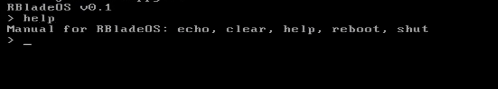

# Usage
`chmod +x build-linux.sh`

`./build-linux.sh`

Soon I will create a builder for windows.

# RBladeOS

RBladeOS is a simple operating system built in Assembly, designed for learning and compatible with older computers. It offers an easy-to-understand foundation, perfect for those who want to study how a system works or use it on legacy PCs. Additionally, RBladeOS allows you to create your own distribution based on its kernel, where you can add drivers, commands, and other components. Whether for learning or building something new, RBladeOS is a practical and customizable platform for developers.

# RBladeOS 0.1

Integration of simple commands into your kernel such as echo, clear, reboot, shutdown, and help. 

